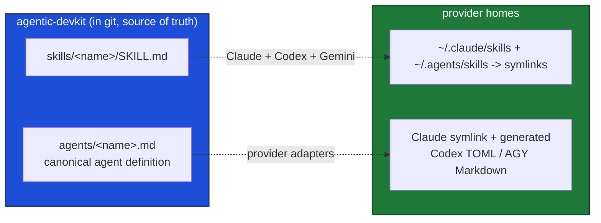

# agentic-devkit

My personal, generic developer setup. This repo wears two hats:

1. **A modular shell workflow system** - git workflows, worktree management, branch cleanup, process utilities, and multi-org shell profiles, all sourced into the shell from one root variable.
2. **The source of truth for my agent skills and guidance** - portable `SKILL.md` workflows serve Claude Code, Codex, and Gemini/AGY; provider-specific assets stay clearly labeled.

If you only remember one thing: **live agent assets are symlinks back into this repo. Edit them here, commit them here.** See "The source-of-truth model" below.

**This repo is public on GitHub.** Pushing here publishes, so everything is deliberately generic: no employer, client, or project specifics - no internal repo, host, service, team, or ticket names, no internal URLs, and nothing that identifies where the work is done. Personal tooling and infrastructure references use neutral placeholders. That is a disclosure boundary, not a style preference; when a rule needs a private repo as its example, describe the shape instead of naming it.

## One setup, equal peers

Claude Code, Codex, and Gemini/AGY are peers over the same canonical sources. A setup or update
request is cross-provider by default regardless of which agent receives it. Install and verify
every supported provider plus every configured overlay; narrow to one provider only when the user
explicitly asks to leave the others untouched.

`AGENTS.md` is the canonical repository guidance file. `CLAUDE.md` and `GEMINI.md` are imports
only. Shared memory sources must describe the machine and policy without claiming a runtime
provider; generated global files add the correct provider identity themselves.

> **Work directly on `main` in this checkout - no feature branches, no worktree for this repo.** This is an adhoc, personal repo kept deliberately low-friction: edit, commit, and push straight to `main`. There is no `develop`, no feature-branch flow, and no PR step here; everything lands on `main`. This is intentional for a concrete reason: the live skills/agents are symlinks into THIS checkout, so a change made in a separate worktree does not go live until it is merged back and this checkout is updated. Editing here makes it live immediately. If a stray feature branch ever shows up, fold its wanted work into `main` and delete it.

> **No AI attribution trailers on commits in this repo.** Leave off `Co-Authored-By` and generated-by lines, regardless of which agent performs the work.

---

## The source-of-truth model (skills, agents, and guidance)

Provider directories hold **links or generated adapters, never independent sources**. The real files live in this repo:

| Consumer path | Source of truth | Support | Installer |
|---|---|---|---|
| `~/.claude/skills/<name>/` | `skills/<name>/` | Claude | `install.sh` / `a_c_skills` |
| `~/.agents/skills/<name>/` | `skills/<name>/` | Codex + Gemini CLI | `install.sh` / `a_c_skills` |
| `~/.gemini/config/skills/<name>/` | `skills/<name>/` | AGY / Antigravity | `install.sh` / `a_c_skills` |
| `~/.claude/agents/<name>.md` | `agents/<name>.md` | Claude subagents (direct links) | `install.sh` / `a_c_agents` |
| `~/.codex/agents/<name>.toml` | generated from `agents/<name>.md` | Codex subagents | `install.sh` / `a_c_agents` |
| `~/.gemini/config/agents/<name>.md` | generated from `agents/<name>.md` | AGY / Antigravity subagents | `install.sh` / `a_c_agents` |
| `~/.gemini/agents/<name>.md` | generated from `agents/<name>.md` | Gemini CLI subagents | `install.sh` / `a_c_agents` |

> **The one-shot install command:** `./install.sh` wires the shell and all supported providers. Use `--provider claude|codex|agy|gemini-cli`; `gemini` selects both Google clients. It is idempotent; `--link-only` skips shell wiring, `-n` dry-runs, and `-f` replaces a conflicting unmanaged target after backing it up.



**Why this design:** one version-controlled source instead of N hand-edited copies scattered across machines. Edit a skill here (or `git pull` on any linked machine) and the live skill updates with no reinstall.

### Golden rule (applies in any session, any project)

When you edit, add, or remove an `a_*` skill or agent that is loaded globally, **you are editing this repo**:

- Make the change in `agentic-devkit/skills/` or `agentic-devkit/agents/`, then commit it here.
- Never hand-copy a skill/agent into a provider's global directory; never treat a generated adapter as an editable source.
- To create, refresh, or repair an installed asset, use the installer. See below.

### Skills installer: `a_c_skills`

`scripts/a_c_skills` (on PATH once the profile is sourced) manages the skill symlinks:

```bash
a_c_skills install          # default: symlink into ~/.claude/skills
a_c_skills install <name>   # just one
a_c_skills status           # show link state for each repo skill
a_c_skills list             # list skills available in this repo
a_c_skills uninstall        # remove the symlinks this tool created
```

Flags: `-n/--dry-run`, `-f/--force` (repoint a link aimed elsewhere). `install.sh` invokes this for both Claude and the shared `~/.agents/skills` directory. It auto-discovers any `skills/<dir>` containing a `SKILL.md`; divergent real directories are backed up before linking. Overlays reuse it with the provider-neutral `SKILLS_SRC` override; `CLAUDE_SKILLS_SRC` remains a compatibility alias.

### Agents installer: `a_c_agents`

`agents/` is a project-agnostic canonical subagent library (see `agents/README.md`). `scripts/a_c_agents` installs it in each provider's native format:

```bash
a_c_agents --provider claude install  # direct Markdown symlinks
a_c_agents --provider codex install   # generated ~/.codex/agents/*.toml
a_c_agents --provider agy install     # generated ~/.gemini/config/agents/*.md
a_c_agents --provider gemini-cli install
a_c_agents --provider codex install <name>
a_c_agents --provider codex status
a_c_agents list             # list agents available in this repo
a_c_agents --provider codex uninstall
```

Same flags as `a_c_skills` (`-n/--dry-run`, `-f/--force`). It auto-discovers every `agents/*.md` (skipping `README.md`). Claude receives a link to the canonical file. Codex and Google clients receive generated files with model and tool translations. Generated files carry a managed marker and are refreshed on reinstall; conflicting unmanaged files are left alone unless `--force` backs them up first.

---

## Naming convention (the marker glossary)

Everything of mine starts with `a_` (my namespace), then **prefix markers** (`x_`, never suffixes) that name the item's trait. Compose in order **`a_` + KIND + optional MODIFIER + name**.

**KIND** (exactly one):

| Marker | Kind | Example |
|---|---|---|
| `sk_` | Skill (on-demand) | `a_sk_message_writer`, invoked `/a_sk_message_writer` |
| `r_` | Routine (unattended / scheduled - its own kind, not `sk_`) | `a_r_l_dependabot_collector`, `a_r_l_pr_review` |
| `sag_` | Sub-agent (subagent def in `agents/`) | `a_sag_crawler`, `a_sag_code_reviewer` |
| `c_` | Command (user-facing CLI entry point / shell function) | `a_c_task_start`, `a_c_skills`, `a_c_process_list` |
| `s_` | Script (helper / sourced library, not a user-facing command) | `a_s_task_common.sh`, `a_s_resolve_repo`, `a_s_crawler` |
| `g_` | **git** command family (see note) | `a_g_worktree_init`, `a_g_branch_cleanup`, `a_g_push` |

**MODIFIER** (optional, after the KIND):

| Marker | Applies to | Means |
|---|---|---|
| `l_` | **routines only** (`a_r_l_*`) | this routine must run **locally** (filesystem, cloned repos, `mdnest`, browser, worktrees), so it cannot be scheduled in the cloud |
| `g_` | skills / agents | **global** (available everywhere) |

> **`l_` is only meaningful on a routine.** A routine is the one kind that could run either in the cloud or on this machine, so it needs the distinction. Everything else (`a_sk_*`, `a_sag_*`, `a_c_*`, `a_g_*`) already runs where the session runs, so `l_` says nothing. Never write `a_sk_l_*`.

So: skill `a_sk_<name>`; routine `a_r_<name>` (cloud-capable) or `a_r_l_<name>` (local-only); agent `a_sag_<name>`.

> **The one `g_` overload:** in the **command/script layer** `g_` means **git** (`a_g_worktree_*`, `a_g_push`). In the **skill/agent layer** `g_` means **global**. Context disambiguates.

`a_r_*` matches every routine, `a_r_l_*` the local-only ones. **Write routines parameterized** (repo, path, epic, base URL, ...) so a scheduled prompt fills in the blanks. The full skill catalog lives in `skills/README.md`; the agent catalog in `agents/README.md`. Do not duplicate those lists here.

---

## Shell architecture

- `MY_WORKFLOW_DIR` is the single root variable, set in the user's `~/my_settings/configs.profile`. Everything derives from it.
- The load chain: `~/.zshrc` -> `~/my_settings/configs.profile` -> `shell/generic.profile`, which sources `sourced/*.sh`, adds `scripts/` to PATH, sets `cd_p` / `cd_w` / `cd_g` / `cd_wf` aliases, and loads the org profile `shell/<org>.<machine>.profile` if configured.
- `sourced/` files run **in the current shell** (can `cd`, `export`). `scripts/` run as **subprocesses** and are auto-added to PATH.

### Layout

```
agentic-devkit/
├── install.sh    # one-shot bootstrap: wire the shell (once) + link all skills & agents (idempotent)
├── shell/        # profile system: configs sample, generic.profile, org/machine profiles
├── sourced/      # functions sourced into the shell: git.sh, worktree.sh, process.sh, doctor.sh, task.sh
├── scripts/      # standalone scripts on PATH: a_c_* (commands), a_g_* (git/worktree/branch), a_s_* (helpers)
├── skills/       # portable Agent Skills shared by Claude, Codex, and Gemini
├── agents/       # canonical subagents rendered into each provider's native schema
├── memory/       # source for all generated global instruction files
├── rules/        # shared rule files (e.g. mdnest.md), imported into global CLAUDE.md and read by agents
├── tools/        # self-contained tools (slack-summarizer, mdcf)
└── docs/         # worktree.md, mac.md, task.md
```

---

## Adding things

**A shell command or script** - needs current-shell context (cd/export)? Add it to a file in `sourced/`. Otherwise add a script to `scripts/` (auto-on-PATH). Pick the marker by trait (see the glossary above): `a_c_` (user-facing command), `a_s_` (helper/library script), `a_g_` (git command). New category of sourced functions? Create `sourced/<name>.sh` and add a `source` line in `generic.profile`.

**A skill** - create `skills/<name>/SKILL.md` (frontmatter `name:` must equal the dir name). Use `a_sk_<name>` for an on-demand skill, or `a_r_<name>` / `a_r_l_<name>` for a routine (`l_` only if it cannot run in the cloud). Run `a_c_skills install <name>`, then commit.

**An agent** - create one canonical `agents/<name>.md` with the documented tier and capability fields. `a_s_render_agent` translates it for Codex and Google clients. Use a skill instead when the workflow should run inline rather than in an isolated subagent context.

**An always-on rule, a machine fact, or a glossary term** - do not hand-edit a provider's generated global file. Edit the source and run `a_c_agent_memory build`. Generic rule -> `memory/core-rules.md`; personal rule, machine identity, or glossary row -> `machine/*.md` in the private overlay.

---

## Not managed by this repo

Leave these to their own systems, do not pull them in: any framework skills/agents installed from a separate source, marketplace skills symlinked from `.agents/skills`, plugin-namespaced skills (`plugin:skill`), and `*-workspace/` optimizer/eval artifacts (gitignored).

---

## Sensitive files (never commit)

- `~/my_settings/configs.profile`
- `~/.aws_keys`, `~/.my_secrets`
- Any org profile with real credentials (`shell/<org>.<machine>.profile`)
- `.claude/settings.local.json`, `tools/slack-summarizer/config.env`

---

## Setup guide

**The fast path is `./install.sh` from the repo root** - it wires the shell, shares skills, and installs native subagents across Claude, Codex, AGY, and Gemini CLI, idempotently. Then `source ~/.zshrc`. Use `--provider` when only one tool should be configured.

1. **Personal config:** with a root instruction repo, its `bootstrap.sh` writes `~/my_settings/a_configs.profile`, which sets `A_ROOT_DIR` and nothing else: every path, the machine name and the tier aliases come from that repo's `root.config`. Standalone, `install.sh` creates `~/my_settings/configs.profile` with `MY_WORKFLOW_DIR` set correctly and the rest left as sample placeholders; fill in the personal, work and global repos paths and the optional org name. Machine type is derived from `uname` and only needs setting to force a non-default org profile. `install.sh` never overwrites an existing config, and leaves the rc alone if it already sources any `my_settings/*.profile`, so the two modes cannot end up fighting over one machine.
2. **(Optional) org profile:** `cp shell/org.machine.profile.sample shell/<org>.<machine>.profile` and set `a_company_name`. Add SSH aliases, directory shortcuts, DB connections there.
3. **Reload:** `source ~/.zshrc`.
4. **Refresh later:** re-run `./install.sh` (or `./install.sh --link-only`) after any `git pull` to pick up new skills/agents. `a_c_skills` / `a_c_agents` remain for granular status/list/single/uninstall.
