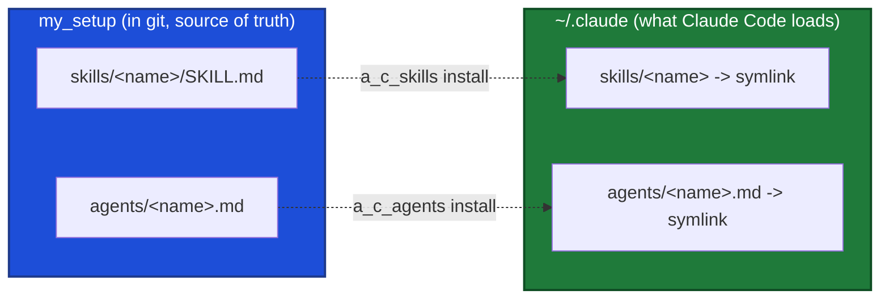

# my_setup

My personal, generic developer setup. This repo wears two hats:

1. **A modular shell workflow system** - git workflows, worktree management, branch cleanup, process utilities, and multi-org shell profiles, all sourced into the shell from one root variable.
2. **The source of truth for my personal Claude Code skills and subagents** - every `a_*` skill and agent lives here under version control and is *symlinked* into the global `~/.claude/` dirs. This repo is where they are authored, edited, and maintained, both the on-demand tools and the unattended **routines** that run on a schedule or autonomously.

If you only remember one thing: **the live skills/agents in `~/.claude/` are symlinks back into this repo. Edit them here, commit them here.** See "The source-of-truth model" below.

Everything here is deliberately generic: no company, client, or project specifics. Personal tooling and infrastructure references use neutral placeholders.

> **Work directly on `main` in this checkout - no feature branches, no worktree for this repo.** This is an adhoc, personal repo kept deliberately low-friction: edit, commit, and push straight to `main`. There is no `develop`, no feature-branch flow, and no PR step here; everything lands on `main`. This is intentional for a concrete reason: the live skills/agents are symlinks into THIS checkout, so a change made in a separate worktree does not go live until it is merged back and this checkout is updated. Editing here makes it live immediately. If a stray feature branch ever shows up, fold its wanted work into `main` and delete it.

---

## The source-of-truth model (skills & agents)

The global dirs that Claude Code loads hold **links, not copies**. The real files live in this repo:

| Global path Claude loads | Symlinks to (source of truth) | Namespace | Installer |
|---|---|---|---|
| `~/.claude/skills/<name>/` | `skills/<name>/` | `a_sk_*`, `a_sk_l_*`, `a_r_*`, `a_r_l_*` | `a_c_skills` |
| `~/.claude/agents/<name>.md` | `agents/<name>.md` | `a_sag_*` subagents | `a_c_agents` |

> **The one-shot install command:** `./install.sh` (at the repo root) is the whole install. On a fresh clone it wires the shell (once) *and* links everything (all skills + all agents); on an already-set-up machine it just re-links. It is idempotent - re-run it after a `git pull` on any linked machine to pick up new skills/agents. `./install.sh --link-only` skips the shell step; `-n` dry-runs; `-f` repoints stray links.



**Why this design:** one version-controlled source instead of N hand-edited copies scattered across machines. Edit a skill here (or `git pull` on any linked machine) and the live skill updates with no reinstall.

### Golden rule (applies in any session, any project)

When you edit, add, or remove an `a_*` skill or agent that is loaded globally, **you are editing this repo**:

- Make the change in `my_setup/skills/` or `my_setup/agents/`, then commit it here.
- Never hand-copy a skill/agent into `~/.claude/` as a standalone file, and never treat the global path as a separate copy. It is a pointer.
- To create or repair a link, use the installer (skills) or `ln -s` (agents). See below.

### Skills installer: `a_c_skills`

`scripts/a_c_skills` (on PATH once the profile is sourced) manages the skill symlinks:

```bash
a_c_skills install          # symlink every repo skill into ~/.claude/skills
a_c_skills install <name>   # just one
a_c_skills status           # show link state for each repo skill
a_c_skills list             # list skills available in this repo
a_c_skills uninstall        # remove the symlinks this tool created
```

Flags: `-n/--dry-run`, `-f/--force` (repoint a link aimed elsewhere). It auto-discovers any `skills/<dir>` containing a `SKILL.md`. If a real (non-link) dir already sits at the target, an identical copy is replaced with a link, and a **divergent** copy is backed up to `~/.claude/skills.backups/<name>.<timestamp>` before linking, so local edits are never silently lost.

### Agents installer: `a_c_agents`

`agents/` is a project-agnostic subagent library (see `agents/README.md`). `scripts/a_c_agents` (on PATH once the profile is sourced) manages the agent symlinks, mirroring `a_c_skills` but for single `.md` files:

```bash
a_c_agents install          # symlink every repo agent into ~/.claude/agents
a_c_agents install <name>   # just one (name with or without .md)
a_c_agents status           # show link state for each repo agent
a_c_agents list             # list agents available in this repo
a_c_agents uninstall        # remove the symlinks this tool created
```

Same flags as `a_c_skills` (`-n/--dry-run`, `-f/--force`). It auto-discovers every `agents/*.md` (skipping `README.md`). An identical real file at the target is replaced with a link; a **divergent** one is backed up to `~/.claude/agents.backups/<name>.<timestamp>` before linking. Or just run `./install.sh` to wire + link everything in one shot.

---

## Naming convention (the marker glossary)

Everything of mine starts with `a_` (my namespace), then **prefix markers** (`x_`, never suffixes) that name the item's trait. Compose in order **`a_` + KIND + optional MODIFIER + name**.

**KIND** (exactly one):

| Marker | Kind | Example |
|---|---|---|
| `sk_` | Skill (on-demand) | `a_sk_message_writer`, invoked `/a_sk_message_writer` |
| `r_` | Routine (unattended / scheduled - its own kind, not `sk_`) | `a_r_l_dependabot_collector`, `a_r_l_pr_review` |
| `sag_` | Sub-agent (subagent def in `agents/`) | `a_sag_crawler`, `a_sag_code_reviewer` |
| `c_` | Command (user-facing CLI entry point / shell function) | `a_c_task_start`, `a_c_skills`, `a_c_process_list` |
| `s_` | Script (helper / sourced library, not a user-facing command) | `a_s_task_common.sh`, `a_s_resolve_repo`, `a_s_crawler` |
| `g_` | **git** command family (see note) | `a_g_worktree_init`, `a_g_branch_cleanup`, `a_g_push` |

**MODIFIER** (optional, after the KIND):

| Marker | Means |
|---|---|
| `l_` | must run **locally** (filesystem, cloned repos, `mdnest`, browser, worktrees) |
| `g_` | **global** (available everywhere) - in the skill/agent sense |

So: on-demand skill `a_sk_<name>`; local on-demand skill `a_sk_l_<name>` (e.g. `a_sk_l_review_pr`); routine `a_r_<name>` (cloud) / `a_r_l_<name>` (local-only); agent `a_sag_<name>`.

> **The one `g_` overload:** in the **command/script layer** `g_` means **git** (`a_g_worktree_*`, `a_g_push`). In the **skill/agent layer** `g_` means **global**. Context disambiguates.

`a_r_*` matches every routine, `a_r_l_*` the local-only ones. **Write routines parameterized** (repo, path, epic, base URL, ...) so a scheduled prompt fills in the blanks. The full skill catalog lives in `skills/README.md`; the agent catalog in `agents/README.md`. Do not duplicate those lists here.

---

## Shell architecture

- `MY_WORKFLOW_DIR` is the single root variable, set in the user's `~/my_settings/configs.profile`. Everything derives from it.
- The load chain: `~/.zshrc` -> `~/my_settings/configs.profile` -> `shell/generic.profile`, which sources `sourced/*.sh`, adds `scripts/` to PATH, sets `cd_p` / `cd_w` / `cd_wf` aliases, and loads the org profile `shell/<org>.<machine>.profile` if configured.
- `sourced/` files run **in the current shell** (can `cd`, `export`). `scripts/` run as **subprocesses** and are auto-added to PATH.

### Layout

```
my_setup/
├── install.sh    # one-shot bootstrap: wire the shell (once) + link all skills & agents (idempotent)
├── shell/        # profile system: configs sample, generic.profile, org/machine profiles
├── sourced/      # functions sourced into the shell: git.sh, worktree.sh, process.sh, doctor.sh, task.sh
├── scripts/      # standalone scripts on PATH: a_c_* (commands), a_g_* (git/worktree/branch), a_s_* (helpers)
├── skills/       # SOURCE OF TRUTH for Claude skills - one dir per skill, symlinked into ~/.claude/skills
├── agents/       # SOURCE OF TRUTH for Claude subagents - one .md per agent, symlinked into ~/.claude/agents
├── rules/        # shared rule files (e.g. mdnest.md), imported into global CLAUDE.md and read by agents
├── tools/        # self-contained tools (slack-summarizer, mdcf)
└── docs/         # worktree.md, mac.md, task.md
```

---

## Adding things

**A shell command or script** - needs current-shell context (cd/export)? Add it to a file in `sourced/`. Otherwise add a script to `scripts/` (auto-on-PATH). Pick the marker by trait (see the glossary above): `a_c_` (user-facing command), `a_s_` (helper/library script), `a_g_` (git command). New category of sourced functions? Create `sourced/<name>.sh` and add a `source` line in `generic.profile`.

**A skill** - create `skills/<name>/SKILL.md` (frontmatter `name:` must equal the dir name). Use `a_sk_<name>` for an on-demand skill (`a_sk_l_<name>` if it must run locally), or `a_r_<name>` / `a_r_l_<name>` for routines. Run `a_c_skills install <name>`, then commit.

**An agent** - create `agents/<name>.md` (`a_sag_` prefix, generic and project-agnostic; see `agents/README.md` for the house conventions). Run `a_c_agents install <name>`, then commit.

---

## Not managed by this repo

Leave these to their own systems, do not pull them in: any framework skills/agents installed from a separate source, marketplace skills symlinked from `.agents/skills`, plugin-namespaced skills (`plugin:skill`), and `*-workspace/` optimizer/eval artifacts (gitignored).

---

## Sensitive files (never commit)

- `~/my_settings/configs.profile`
- `~/.aws_keys`, `~/.my_secrets`
- Any org profile with real credentials (`shell/<org>.<machine>.profile`)
- `.claude/settings.local.json`, `tools/slack-summarizer/config.env`

---

## Setup guide

**The fast path is `./install.sh` from the repo root** - it wires the shell (creates `~/my_settings/configs.profile` from the sample with `MY_WORKFLOW_DIR` pointed at this checkout, and appends the source line to `~/.zshrc`/`~/.bashrc`) and links every skill + agent, idempotently. Then `source ~/.zshrc`. That is the whole install for most machines; do the steps below only to customize.

1. **Personal config:** `install.sh` creates `~/my_settings/configs.profile` with `MY_WORKFLOW_DIR` set correctly but the rest left as sample placeholders. Edit it to fill in: personal repos path, work repos path, machine type (`m1` / `i7`), and optional org name. (If a config already exists, `install.sh` never overwrites it.)
2. **(Optional) org profile:** `cp shell/org.machine.profile.sample shell/<org>.<machine>.profile` and set `a_company_name`. Add SSH aliases, directory shortcuts, DB connections there.
3. **Reload:** `source ~/.zshrc`.
4. **Refresh later:** re-run `./install.sh` (or `./install.sh --link-only`) after any `git pull` to pick up new skills/agents. `a_c_skills` / `a_c_agents` remain for granular status/list/single/uninstall.
