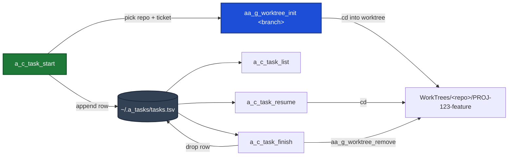

# Task workflow (`a_c_task_*`)

A thin, ticket-aware layer on top of the AI Awareness worktree helpers. One
command starts a task (pick repo -> name a branch from a Jira ticket -> make a
worktree), the rest let you list, resume, and finish tasks across every repo.



## Commands

| Command | What it does |
|---|---|
| `a_c_task_start [-r repo] [-t ticket] [-f feature] [-b base] [-c] [-p prompt] [-z session] [-y] [-- claude args]` | Pick a repo (the repo you're currently in is pinned first as `current =>`, then the most-recently-worked-in repos under `cd_w` ranked by last commit; or a name / full path), turn a Jira ticket into a branch `PROJ-123-feature-name`, create a worktree via `aa_g_worktree_init`, cd in, and register the task. `-b` forks from that base branch (e.g. `main` or `story/PROJ-123-foo`) and skips `aa_g_worktree_init`'s base picker; omit it to be prompted. Before creating anything it asks `Proceed? [Y/n]`; `-y` (or a non-interactive run) skips that (see "Confirmation & auto mode"). With `-r -t -f -b -y` set it runs with no prompts at all. `-c` then launches a Remote-Control Claude session in the new worktree (see below). `-z` opens the worktree in a named zellij session/tab instead of the current terminal (see below). |
| `a_c_task_resume [ticket\|branch]` | Jump back into an active task's worktree. No argument -> numbered menu with live dirty / ahead-behind state. |
| `a_c_task_list` | Read-only table of all active tasks and their worktree state. |
| `a_c_task_finish [ticket\|branch] [-v] [-f] [--keep-remote]` | Remove the worktree + branch via `aa_g_worktree_remove` and drop the task from the registry. Flags pass straight through (`-v` verifies merged first). |

## Start straight into Claude (Remote Control)

`-c` makes `a_c_task_start` hand the new worktree to `scripts/a_c_claude_remote`,
which launches an interactive Claude Code session there with Remote Control
already on (so you can drive it from the app). The session is named after the
ticket, and it defaults to `--permission-mode acceptEdits` so a remote-driven
session is not blocked waiting for terminal approvals.

```bash
# create the worktree AND drop into a remote-controlled Claude session
a_c_task_start -r myrepo -t 942 -f "list filter" -b main -c

# seed the first message (implies -c)
a_c_task_start -t 942 -f "list filter" -b main -p "read the ticket, then start"

# override the default permission mode (anything after -- goes to claude)
a_c_task_start -t 942 -f "list filter" -b main -c -- --permission-mode plan
```

`a_c_task_start` is sourced (so its `cd` sticks) but runs `a_c_claude_remote` as
a child process. `a_c_claude_remote` `exec`s `claude`, so only that child is
replaced; when you exit Claude, control returns to your shell — still inside the
worktree. `a_c_claude_remote` is also usable on its own and from other scripts:

```bash
a_c_claude_remote ~/Repos/foo "fix the build" -- --permission-mode acceptEdits
a_c_claude_remote -N -n demo ~/Repos/foo "hi"   # -N prints the command, no launch
```

## Open in a zellij session (`-z`)

`-z <session>` lands the new task in a named [zellij](https://zellij.dev) session
instead of the current terminal. If that session is not already running it is
created (detached), then a tab named for the ticket + a short feature slug is
added to it (e.g. `PROJ-123 add-login-page`). Re-running for the same task just
focuses that tab, it never piles up duplicates. The session name is yours to
choose, so you can keep one session per area of work (here, `pilgc`):

```bash
# open the worktree as a tab in the "pilgc" session (create the session if needed)
a_c_task_start -r myrepo -t 942 -f "list filter" -b main -z mytab

# combine with -c so Claude runs inside that tab (single pane, drops to a shell on exit)
a_c_task_start -r myrepo -t 942 -f "list filter" -b main -z mytab -c
```

How it lands you there depends on where you run it from:

- **From a normal terminal** (not inside zellij): it attaches you to the session
  on the new tab. Detach (`Ctrl-o d`) to return to your shell, still in the worktree.
- **From inside that same zellij session**: it just focuses the new tab.
- **From inside a *different* zellij session**: it sets the tab up in the target
  session in the background and prints how to switch (your session manager,
  `Ctrl-o w`, or detach + `zellij attach <session>`) — zellij has no CLI to hop
  between sessions, and focusing a tab in a detached session would block.

`-z` is optional and composes with the rest: omit it for the normal in-terminal
behaviour, add `-c`/`-p` to run Claude inside the tab. If `zellij` is not on
`PATH`, `-z` is ignored with a notice and the command falls back to the terminal.

## Confirmation & auto mode

On an interactive terminal, `a_c_task_start` prints a summary (repo, branch,
base, and whether it will launch Claude or open a zellij tab) and asks
`Proceed? [Y/n]` before it creates the worktree. Enter accepts; `n` aborts and
nothing is created.

That gate is skipped so a task can start hands-off:

- `-y` / `--yes` (alias `--auto`) on the command line, or
- a non-interactive run (no TTY on stdin), e.g. when Claude or a scheduled
  routine drives the command from a script.

```bash
# fully hands-off: no repo/ticket/feature prompt, no confirm
a_c_task_start -y -r myrepo -t 942 -f "list filter" -b main

# Claude starts AND drives the task (auto-accept + remote Claude session)
a_c_task_start -y -r myrepo -t 942 -f "list filter" -b main -c -p "read the ticket, then start"
```

## Branch naming

`<TICKET>-<feature-slug>`. The ticket is normalized: `PROJ-123`, `proj123`, a bare
`123` (default project key `PROJ`, override with `A_TASK_DEFAULT_KEY`), or a pasted
Jira browse URL like `https://your-org.atlassian.net/browse/PROJ-1009` all resolve
to the key. The feature text is slugified (lowercased, non-alphanumeric runs
collapse to single dashes). Example: ticket `123` + "Add login page" ->
`PROJ-123-add-login-page`.

## Jira auto-fill (optional)

When Jira credentials are present, `a_c_task_start` fetches the ticket's title
and pre-fills the feature name (press Enter to accept the suggested slug, or type
your own). Without credentials it silently falls back to the manual prompt, so
the feature is purely additive. `-f/--feature` skips the fetch entirely.

Put these in `~/.my_secrets` (sourced by your profile, never committed):

| Var | Meaning |
|---|---|
| `A_JIRA_EMAIL` | Your Atlassian account email. |
| `A_JIRA_TOKEN` | A Jira API token. Create at `https://id.atlassian.com/manage-profile/security/api-tokens`. |
| `A_JIRA_BASE` | Site base URL. Optional; defaults to `https://your-org.atlassian.net`. |

The token is fed to `curl -K -` over stdin, so it never shows up in `ps`/argv.
Only the issue summary is read (a read-only GET).

## State

A single registry file, one row per active task:

```
${A_TASK_HOME:-~/.a_tasks}/tasks.tsv
# ticket  branch  mode  repo  worktree  created
```

`list` / `resume` / `finish` reconcile each row against the real worktree on
disk, so a manually-removed worktree shows as `missing` rather than lying.

## Theme & animation (Matrix)

The suite wears a green-on-black "Matrix / hacker" theme. The palette lives in
`a_s_task_common.sh` under the existing `A_T_*` names (so every command re-themes
at once): success/highlights are bold bright green, info/headers plain green,
secondary text dim green, warnings bright green, and errors a reverse-video green
badge so they still stand out. Colors are emitted only for an interactive
terminal and honour `NO_COLOR`, so piped/scripted output stays clean.

`a_c_task_start` also plays a short digital-rain splash (`scripts/a_s_task_fx`,
run as its own bash process so it can't disturb your zsh) before it starts the
work. It is interactive-only and self-disabling everywhere else. Env knobs:

| Var | Effect |
|---|---|
| `A_T_NO_FX=1` | Skip the rain splash (keep the colors). |
| `A_T_FX_FRAMES=N` | Splash length in frames (default 16, ~45ms each). |
| `NO_COLOR=1` | Drop all colors (and, being non-interactive-friendly, the splash too). |

## Dependencies

These wrap the **AI Awareness** framework's `aa_g_worktree_init` /
`aa_g_worktree_remove` (looked up via `AA_WORKTREE_DIR`, default
`~/.claude/scripts/aa-worktree`). If the framework lives elsewhere, export
`AA_WORKTREE_DIR`. Worktrees land at `<repos>/WorkTrees/<project>/<branch>`,
exactly where the AA helpers put them.

## How it is wired

The real logic is in `scripts/a_c_task_{start,resume,list,finish}` plus the
shared `scripts/a_s_task_common.sh`. `sourced/task.sh` defines wrapper functions
that **source** those scripts (so the final `cd` lands in your shell) and is
loaded from `generic.profile`.
