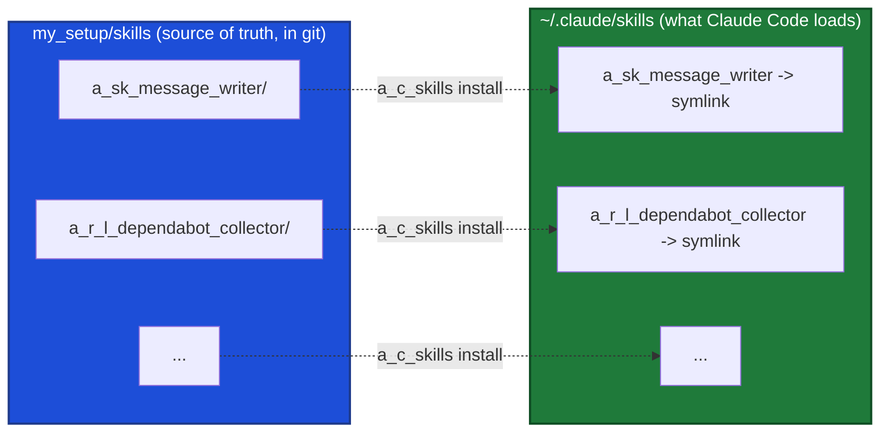

# Skills

Source of truth for my personal [Claude Code skills](https://docs.claude.com/en/docs/claude-code/skills). Each skill lives in its own directory here and is **symlinked** into the global skills dir (`~/.claude/skills/`) by `a_c_skills`.

## Why symlinks

The global dir holds links, not copies. So:

- Editing a skill here updates the live skill immediately. No reinstall.
- `git pull` on any machine that ran the installer picks up every change.
- One source of truth, under version control, instead of N hand-edited copies scattered across machines.



Claude Code follows symlinked skill directories, so a linked skill behaves exactly like a real one.

## Usage

The `a_c_skills` command (in `scripts/`, on your PATH once the profile is sourced):

```bash
a_c_skills install        # symlink every repo skill into ~/.claude/skills
a_c_skills install a_sk_message_writer   # just one
a_c_skills status         # show link state for every repo skill
a_c_skills list           # list skills available in this repo
a_c_skills uninstall      # remove the symlinks this tool created
```

Flags: `-n/--dry-run` (preview, change nothing), `-f/--force` (repoint a link that points elsewhere), `-h/--help`.

Behavior worth knowing:

- If the global target is already the correct symlink, it is left alone.
- If a **real directory** sits at the target, the installer compares it to the repo copy. Identical content is replaced with a link. **Divergent** content is moved to `~/.claude/skills.backups/<name>.<timestamp>` (outside the scan path so it is not loaded as a duplicate) and then linked, so local edits are never silently lost.
- Override the target with `CLAUDE_SKILLS_DIR`, and the backup root with `CLAUDE_SKILLS_BACKUP_DIR`.

## Naming convention

Everything of mine starts with `a_` (my namespace), then **prefix markers** (`x_`, never suffixes) naming the trait. Compose as **`a_` + KIND + optional MODIFIER + name**. For skills the KIND is `sk_` (on-demand skill) or `r_` (routine); the MODIFIER `l_` means it must run locally.

- `a_sk_<name>` — **on-demand skill** (e.g. `a_sk_message_writer`).
- `a_sk_l_<name>` — **on-demand skill that must run locally** (filesystem, cloned repos, worktrees, `gh`, `mdnest`, browser). Still on-demand, not a routine (e.g. `a_sk_l_review_pr`). A routine may call it.
- `a_r_<name>` — **routine, cloud-capable** / location-agnostic (pure API/MCP, no local filesystem). Invoked as `run a_r_<name>: ...`.
- `a_r_l_<name>` — **routine that must run locally** (filesystem, cloned repos, `mdnest`, browser, worktrees).

Full marker glossary (used across the whole repo, not just skills): `a_` = mine (Ahsan) · `sk_` = skill · `r_` = routine · `sag_` = sub-agent · `c_` = command · `s_` = script · `sp_` = project script · `g_` = git (command layer) / global (skill layer) · `l_` = local. So `a_r_*` matches every routine, `a_r_l_*` the local-only ones, and `a_sk_l_*` is an on-demand local skill. Routines are written to be **parameterized**: the scheduled prompt fills in the blanks (repo, path, epic, base URL, ...), e.g. `run a_r_l_dependabot_collector for repo=my-service`.

## Skills in this repo

### Routines (`a_r_` / `a_r_l_`)

| Skill | Runs | What it does |
|-------|------|--------------|
| `a_r_l_dependabot_collector` | local | A repo's open Dependabot PRs: fix red bumps to green, flag risky ones, batch the rest onto the current month's release branch, keep one consolidated PR open for review. Runs weekly onto a monthly release; refreshes the PR (new one, close old) so the org stale-PR auto-close can't sweep it. Param: `repo`. |
| `a_r_l_pr_review` | local | Review GitHub PRs in an isolated worktree with parallel agents, on a `review/pr-<N>` branch that tracks the PR source. Params: `repo`, `pr` (number / `mine`). |
| `a_r_l_staging_qa_sweep` | local | Unattended staging smoke-test that files only confirmed, reproducible bugs to a Jira epic (settle-and-reproduce gate, dedup-first). Params: `flow_skill`, `base_url`, `epic`. |
| `a_r_l_weekly_status_report` | local | Reconcile a task-flow workspace against real merge state, then generate the weekly report off the corrected state. Params: `workspace_dir`, `audience`, `report_dest`. |

### Interactive (run on demand)

| Skill | What it does |
|-------|--------------|
| `a_sk_message_writer` | Draft / sharpen professional work messages (Slack, email, escalations) from a VP of Engineering standpoint. |
| `a_sk_routine_instruction_writer` | Turn a rough task description into a clean, self-contained instruction prompt for an autonomous or scheduled routine. |
| `a_sk_l_review_pr` | Review a GitHub PR end-to-end from just its URL: resolve the repo to your existing local clone (cache → `cd_w` scan, no duplicate clone — via `scripts/a_s_resolve_repo`), worktree the PR's real head branch updated to latest, run the project's `review-pr` (or global `global-pr-reviewer`), auto-post the bar-clearing comments, then tear the worktree + local branch down (remote never touched). Params: `pr` (URL / `owner/repo#N`), `post`, `reviewer`. Local. |
| `a_sk_commit` | Turn the current changes into a clean, convention-matching git commit (delegates the message to `a_sag_commit_writer`). Imported + de-coupled from an upstream framework. |
| `a_sk_pr` | Open a GitHub PR for the current branch, filling the project's PR template (via `a_sag_pr_writer`), correct base, right permission posture. Imported + de-coupled from an upstream framework. |
| `a_sk_sonarqube_coverage` | Drive new-code test coverage up to the SonarQube / CI gate (find coverage cmd → test the uncovered changed lines in the project's testing style → re-run until green). Imported + de-coupled from `sonarqube-test-coverage`. |

### Personal-only skills live in a private overlay

Personal-life and personal-tool skills (OLX hunter, PSX advisor, the AI / Claude trackers, session digest, mdnest fix) are **not in this repo**. They live in a private overlay repo that reuses this repo's installers via `CLAUDE_SKILLS_SRC` / `CLAUDE_AGENTS_SRC`, so nothing is duplicated. This repo stays generic and publicly shareable.

## Adding a new skill

1. Create `skills/<name>/SKILL.md` (with YAML frontmatter: `name`, `description`). My own skills use the `a_sk_<name>` prefix (`a_sk_l_<name>` if local-only); routines use `a_r_<name>` (cloud-capable) or `a_r_l_<name>` (local-only). See **Naming convention** above. The `name:` in frontmatter must match the directory name.
2. Add any supporting files alongside it (`references/`, `scripts/`, `evals/`).
3. Run `a_c_skills install <name>` (or just `a_c_skills install`).
4. Commit. The installer auto-discovers any directory here that contains a `SKILL.md`.

## Not tracked here

- `*-workspace/` directories and optimizer/eval outputs (`opt-results/`, `opt-report.html`, `opt-loop.log`) are runtime artifacts and are gitignored.
- Skills managed by other systems are intentionally left out of this repo: framework skills installed from a separate source, marketplace skills symlinked from `.agents/skills` (e.g. `find-skills`, `sonarqube-fix`), and plugin-namespaced skills (`plugin:skill`).
